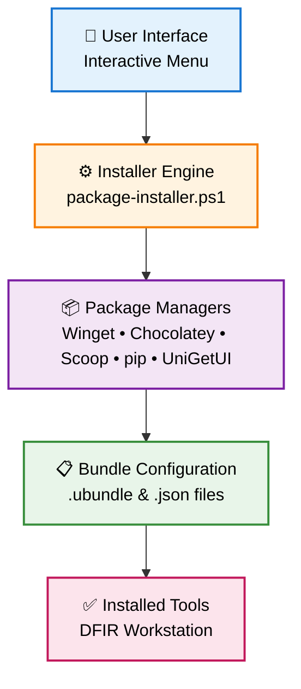

<p align="center">
  
</p>

# ForensicOS

ForensicOS is a practical, package-driven bootstrap repository for building and maintaining a Windows DFIR workstation. It combines curated package bundles, installation automation, and package-manager integration so environments can be reproduced quickly and consistently.

[](https://www.gnu.org/licenses/agpl-3.0)
[](https://microsoft.com/powershell)
[](https://www.microsoft.com/windows)

## Table of Contents

- [ForensicOS](#forensicos)
  - [Table of Contents](#table-of-contents)
    - [☕ Like ForensicOS?](#-like-forensicos)
  - [Requirements](#requirements)
  - [Installation Instructions](#installation-instructions)
    - [Pre-installation](#pre-installation)
    - [ForensicOS installation](#forensicos-installation)
    - [Installer actions](#installer-actions)
  - [Capabilities](#capabilities)
  - [Use Cases](#use-cases)
  - [Architecture](#architecture)
  - [What's in the Bundles?](#whats-in-the-bundles)
    - [Example Bundle Structure](#example-bundle-structure)
    - [Common Bundle Categories](#common-bundle-categories)
    - [Creating Custom Bundles](#creating-custom-bundles)
  - [Troubleshooting](#troubleshooting)
    - [Log Locations](#log-locations)
    - [Common Issues](#common-issues)
    - [Getting Help](#getting-help)
  - [Contributing](#contributing)
  - [Roadmap](#roadmap)
    - [Current Limitations](#current-limitations)
    - [Future Enhancements](#future-enhancements)
  - [Legal Notice](#legal-notice)
  - [Status](#status)

<div align="center">

### ☕ Like ForensicOS?

If this project has helped your DFIR workflow, consider buying the maintainer a coffee to support ongoing development.

[](https://ko-fi.com/brottus)

</div>

## Requirements

ForensicOS should be installed on a dedicated lab workstation or virtual machine. Recommended prerequisites:

- Windows 10 or later.
- PowerShell 5.1 or later.
- Administrator rights for the installation session.
- Stable internet connection for package and bundle downloads.
- At least 60 GB free disk space for tooling.
- Security controls configured to allow package downloads and installer execution.

## Installation Instructions

### Pre-installation

- Prepare a fresh Windows VM or workstation snapshot/checkpoint.
- Decide whether you will use remote bundles, local bundle files, or both.
- Confirm outbound network access to GitHub raw content and package sources.
- Close non-essential software before running the installer.

### ForensicOS installation

- Open PowerShell as Administrator.
- Quick install (2 commands):

```powershell
Set-ExecutionPolicy Bypass -Scope Process -Force
$p = "$([Environment]::GetFolderPath('Desktop'))\forensicos-installer.ps1"; Invoke-WebRequest -Uri "https://raw.githubusercontent.com/Brottus/ForensicOS/main/forensicos-installer.ps1" -OutFile $p; Unblock-File $p; & $p
```

- Manual install:

```powershell
(New-Object Net.WebClient).DownloadFile('https://raw.githubusercontent.com/Brottus/ForensicOS/main/forensicos-installer.ps1', "$([Environment]::GetFolderPath('Desktop'))\forensicos-installer.ps1")
Unblock-File "$([Environment]::GetFolderPath('Desktop'))\forensicos-installer.ps1"
Set-ExecutionPolicy Bypass -Scope Process -Force
& "$([Environment]::GetFolderPath('Desktop'))\forensicos-installer.ps1"
```

- Follow the interactive prompts to select bundle and optional actions.
- Review logs and reboot when prompted at the end of installation.

### Installer actions

The installer currently supports the following selectable actions:

- Define custom install path.
- Install pip packages.
- Install Chocolatey.
- Install Scoop.
- Install UniGetUI.
- Add .py to executable paths for Python script execution.
- Add .html to executable paths.
- Use debloater script for Windows.
- Download SANS DFIR posters.
- Set forensic workstation wallpaper.

In addition to selected actions, the installer always handles:

- Bundle selection (remote or local file).
- Package installation from the selected bundle.
- Desktop shortcut creation.
- Execution summary output.

## Capabilities

Core capabilities include:

- Bundle-driven package installation with support for multiple package managers.
- Optional installation and configuration of Chocolatey, Scoop, and UniGetUI.
- Optional installation of Python package requirements with managed prefix/path setup.
- Optional post-install profile updates for script execution extensions.
- Optional execution of a Windows debloat workflow.
- Optional wallpaper setup for desktop and lock screen.
- Optional download of SANS DFIR reference posters to the Desktop.
- Automatic desktop shortcut creation to the selected tools path.
- Module installation flow for ForensicOS.Linker with gallery-first and fallback download behavior.

## Use Cases

ForensicOS is designed for professionals who need to quickly build and rebuild Windows DFIR environments:

- **Incident Response Teams**: Rapidly deploy forensic workstations during active investigations.
- **Malware Analysis Labs**: Create reproducible, isolated environments for binary analysis and reverse engineering.
- **Forensics Training**: Ensure consistent tool availability across student VMs in classroom settings.
- **DFIR Engineering**: Maintain parity across multiple analysis systems with version-controlled bundle configurations.
- **Threat Hunting Platforms**: Bootstrap dedicated hunting workstations with curated tool selections.
- **Digital Forensics Courses**: Provide instructors with scripted, repeatable lab environment setup.

## Architecture

ForensicOS uses a layered design:



**Key Design Principles:**
- **Bundle-first**: All tools are installed from curated bundles, not ad-hoc selections.
- **Package-manager agnostic**: Support multiple package sources to maximize tool availability.
- **Interactive but reproducible**: User choices are logged for review; the same choices can be replayed from bundles.
- **Resilient to failures**: Per-package error handling with summary reporting; one package failure does not block the entire installation.

## What's in the Bundles?

Bundles are JSON-based package collections that define tool sets for specific scenarios:

### Example Bundle Structure

```json
{
  "bundles": [
    {
      "Description": "Core DFIR Tools",
      "BundleUrl": "https://example.com/bundles/dfir-core.ubundle",
      "RequiredManagers": ["winget", "chocolatey"]
    },
    {
      "Description": "Malware Analysis Lab",
      "BundleUrl": "https://example.com/bundles/malware-lab.ubundle",
      "RequiredManagers": ["winget", "scoop"]
    },
    {
      "Description": "Python Development & Forensics",
      "BundleUrl": "https://example.com/bundles/python-forensics.ubundle",
      "RequiredManagers": ["pip", "chocolatey"]
    }
  ]
}
```

### Common Bundle Categories

- **Core DFIR**: File carving, registry analysis, event log parsing, timeline tools
- **Malware Analysis**: Debuggers, disassemblers, sandbox integration, memory analysis
- **Network Analysis**: Packet capture, protocol analysis, traffic forensics
- **Python Forensics**: Autopsy, volatility, dfVFS, plaso plugins
- **Specialized**: iOS forensics, cloud forensics, mobile device tools

### Creating Custom Bundles

You can create your own bundle by:

1. Creating a `.ubundle` or `.json` file with your package list
2. Specifying the required package managers
3. Placing it locally or hosting it remotely
4. Selecting it at installation time

## Troubleshooting

If installation fails:

- Ensure you are running the installer from an elevated PowerShell session.
- Re-run with a stable internet connection.
- Validate that package sources are reachable (test with `winget search`, `choco search`, `scoop search`).
- Review the generated logs in the selected install base path.

### Log Locations

For each installer run, two log files are created in your selected install base path:

- **Structured installer log**: `forensicos-install-YYYYMMDD-HHMMSS.log`
  - Timestamped action/event log with success/failure status
  - Useful for programmatic parsing and audit trails

- **Console transcript log**: `forensicos-install-console-YYYYMMDD-HHMMSS.log`
  - Full console-visible output captured during installation
  - Includes all package manager output, warnings, and error messages

### Common Issues

**Issue: "Package not found in any package manager"**
- Verify package manager is installed: `winget list`, `choco list`, `scoop list`
- Check if package name matches package manager registry
- Validate bundle configuration specifies correct package manager

**Issue: "Execution Policy" errors**
- Run installer with: `Set-ExecutionPolicy Bypass -Scope Process -Force`
- Or in Group Policy limited environment: `Set-ExecutionPolicy -Scope CurrentUser Bypass`

**Issue: "Network timeout" during downloads**
- Verify outbound access to package sources (GitHub, Chocolatey, Winget repos)
- Re-run installer—many timeouts are transient
- Check firewall/proxy rules aren't blocking package manager downloads

**Issue: "Module not found: ForensicOS.Linker"**
- Installer will attempt download from PSGallery, then fallback to GitHub
- If both fail, manually install: `Install-Module ForensicOS.Linker -Force`
- Check internet connectivity and PSGallery availability

### Getting Help

- Check the [Roadmap](#roadmap) for known limitations
- Review generated log files for specific package failures
- Open an issue with:
  - Windows version and PowerShell version (`$PSVersionTable`)
  - Both log files (structured + transcript)
  - Bundle configuration used
  - Exact error message from logs

## Contributing

Contributions are welcome. Please open issues or pull requests for:

- Bundle updates.
- Installer improvements.
- Package manifest additions and fixes.
- Documentation corrections.

## Roadmap

### Current Limitations

- **No uninstallation**: ForensicOS currently only supports fresh installations. Uninstalling tools or bundles requires manual removal.
- **No parameter-based configuration**: Installer requires interactive menu selection; automated deployment via command-line parameters is not yet supported.
- **No dependency checking**: Bundle files do not automatically detect or pre-select required package managers. Users must manually ensure Chocolatey, Scoop, or other managers are available before bundle selection.
- **Limited tool bundles**: Current bundle coverage focuses on core DFIR tools. Specialized tooling and custom bundles require manual manifest creation.
- **PowerShell module distribution**: The ForensicOS.Linker module is not yet published to PSGallery, requiring download fallback mechanisms during installation.

### Future Enhancements

- **Automated deployment**: CLI parameter support for bundle selection and options to enable fully scripted, unattended installation in enterprise environments.
- **PSGallery publishing**: Publish ForensicOS.Linker to PowerShell Gallery to eliminate fallback download complexity.
- **Comprehensive bundle library**: Build and publish verified bundles for common DFIR scenarios (incident response, malware analysis, mobile forensics, etc.).
- **Uninstall capability**: Support selective tool removal and rollback to previous configurations.
- **MSI wrapper and manifest generation**: Expanding package manager support requires either MSI wrapping for non-packaged tools or automated manifest generation to work with Winget, Chocolatey, and Scoop ecosystems.
- **Documentation**: Expanded GitBook-style documentation and architectural deep-dives for advanced customization.
- **Add Startmenu items**: Expand the Powershell module to also create Start menu items

## Legal Notice

> This download configuration script is provided to assist cyber security analysts in creating handy and versatile toolboxes for malware analysis environments. It provides a convenient interface for them to obtain a useful set of analysis tools directly from their original sources. Installation and use of this script is subject to the GNU Affero General Public License (AGPL). You as a user of this script must review, accept, and comply with the license terms of each downloaded/installed package. By proceeding with the installation, you are accepting the license terms of each package and acknowledging that your use of each package will be subject to its respective license terms.

## Status

This repository is actively evolving as bundles, package coverage, and installation flows are refined.
